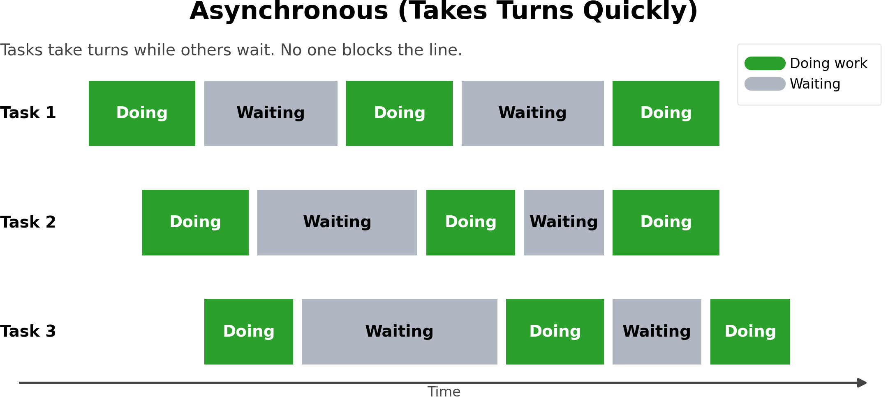
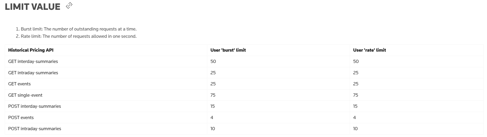
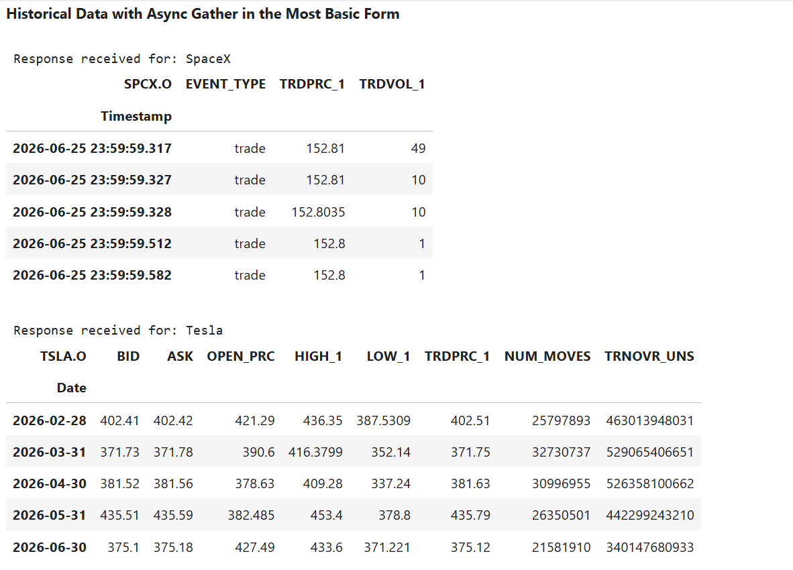

# Concurrent Data Platform API Calls with Python Asyncio Gather and Data Library for Python

## Overview

This article is a semi-sequel to my [Concurrent Data Platform API Calls with Python Asyncio and HTTPX](https://github.com/LSEG-API-Samples/Example.RDP.Python.Async.HTTPX) article. That article shows how to use Python and the [HTTPX](https://www.python-httpx.org/) library to make concurrent HTTP REST requests to LSEG [Data Platform](https://developers.lseg.com/en/api-catalog/refinitiv-data-platform/refinitiv-data-platform-apis) asynchronously. This project shifts away from manually sending HTTP REST requests and instead uses the easy-to-use [LSEG Data Library for Python](https://developers.lseg.com/en/api-catalog/lseg-data-platform/lseg-data-library-for-python). The Data Library for Python Historical Pricing module offers the `get_data_async` method to request historical data asynchronously, letting developers send multiple requests concurrently without blocking the process.

There is already a [Content layer - How to send parallel requests](https://github.com/LSEG-API-Samples/Example.DataLibrary.Python/blob/lseg-data-examples/Examples/2-Content/2.01-HistoricalPricing/EX-2.01.02-HistoricalPricing-ParallelRequests.ipynb) example on GitHup. However, this article provides a more in-depth exploration of making parallel requests using asyncio, offering additional details and greater flexibility beyond what is covered in the original example.

**Note**: This article is based on the Data Library for Python version 2.1.1 using the Platform Session. The library behavior might change in future releases.

## What are Data Platform APIs?

Let’s start with what the Data Platform APIs are. [LSEG Data Platform](https://developers.lseg.com/en/api-catalog/refinitiv-data-platform/refinitiv-data-platform-apis) (RDP APIs, also known as Delivery Platform in LSEG Real-Time) provides simple web based API access to a broad range of LSEG content. The Data Library connects and consumes data from the Data Platform when using the **Platform Session**.

RDP APIs give developers seamless and holistic access to all of the LSEG content such as Historical Pricing, Environmental Social and Governance (ESG), News, Research, etc, and commingled with their content, enriching, integrating, and distributing the data through a single interface, delivered wherever they need it.

For more detail regarding the Data Platform, please see the following APIs resources: 
- [Quick Start](https://developers.lseg.com/en/api-catalog/refinitiv-data-platform/refinitiv-data-platform-apis/quick-start) page.
- [Tutorials](https://developers.lseg.com/en/api-catalog/refinitiv-data-platform/refinitiv-data-platform-apis/tutorials) page.
- [RDP APIs: Introduction to the Request-Response API](https://developers.lseg.com/en/api-catalog/refinitiv-data-platform/refinitiv-data-platform-apis/tutorials#introduction-to-the-request-response-api) page.

That covers and overview of Data Platform APIs.

## What is Python Asyncio? And how it relate to Data Library for Python

Thats bring us to the next important library, the Python asyncio. Python [asyncio](https://docs.python.org/3/library/asyncio.html) is a library for writing concurrent code with async/await. Common asyncio interfaces for concurrent programming include:

- [asyncio.create_task(coro)](https://docs.python.org/3/library/asyncio-task.html#asyncio.create_task), which wraps one [coroutine](https://docs.python.org/3/library/asyncio-task.html#coroutine) in a [Task](https://docs.python.org/3/library/asyncio-task.html#asyncio.Task) and schedules it for execution, returning the Task object.
- [asyncio.gather(*aws)](https://docs.python.org/3/library/asyncio-task.html#asyncio.gather), which runs [awaitables](https://docs.python.org/3/library/asyncio-task.html#asyncio-awaitables) in the aws sequence concurrently.
- [Task Groups](https://docs.python.org/3/library/asyncio-task.html#task-groups), a modern task-management API that provides a reliable way to wait for all tasks in a group to finish using [asyncio.TaskGroup](https://docs.python.org/3/library/asyncio-task.html#asyncio.TaskGroup) together with task creation APIs such as [asyncio.create_task(coro)](https://docs.python.org/3/library/asyncio-task.html#asyncio.create_task).

This article demonstrates how to use the [Data Library for Python](https://developers.lseg.com/en/api-catalog/lseg-data-platform/lseg-data-library-for-python) Content Layer Historical Pricing get_data_async method for requesting multiple RICs concurrently using asyncio gather.

The workflow uses a Platform Session connection. If you are using another session type, refer to the [Data Library Quickstart](https://developers.lseg.com/en/api-catalog/lseg-data-platform/lseg-data-library-for-python/quick-start).

## (Recap) What are Synchronous and Asynchronous Execution Models?

Before proceeding, I would like to briefly recap the synchronous and asynchronous execution models as follows.

**Synchronous** code runs tasks one at a time — each request must complete before the next one starts. The program blocks and waits at every I/O-bound call, so if a request takes 60 seconds, nothing else runs for those 60 seconds. Fine for a single request, but a real bottleneck when fetching data with many calls.


**Asynchronous** code lets multiple tasks run concurrently. While one request is waiting for a network response, the event loop hands control to the next task instead of sitting idle.



The real payoff comes when you have **many requests to make**. With `asyncio.gather()` and `asyncio.TaskGroup()`, all requests are fired concurrently so the total time is roughly that of the single slowest response — not the sum of all response times.

That covers the basic of synchronous and asynchronous executions.

## Throttling and Rate Limits 

My next point is the API calls rate limits. The Data Platform API request limits (throttles) to effectively manage and protect its service and ensure fair usage across the non-streaming content. 

An application would receive an error from the API call if an application reached or exceeds a limit (especially with the Asynchronous HTTP calls). You required to make some necessary adjustments to rectify the interaction with the API and retry the respective API call. 

Two different server errors on API request limits are: 

| **HTTP Status** | **Detail** |
| --- | --- |
| **429** | **Error Message**: too many attempts |
|  | **Description**: A per account limit where the number of requests per second is limited for each account accessing the platform. If this limit is reached, applications will receive a standard HTTP error (HTTP 429 too many requests). |
|  | **Suggestion**: Please reduce the number of requests per second and retry. |

Please find more detail regarding the Data Platform HTTP error status messages from the [RDP API General Guidelines](https://developers.lseg.com/en/api-catalog/refinitiv-data-platform/refinitiv-data-platform-apis/documentation) document page.

The Historical Pricing endpoint rate limits information is available on the **Reference** tab of the [Data Platform API Playground](https://apidocs.refinitiv.com/Apps/ApiDocs) page. The current rate limits (**As of Mar 2026**) is as follows:



## Prerequisite

You should have a basic understanding of Python’s asyncio before getting started. If you need a quick refresher, these resources are solid:

- [Python's asyncio: A Hands-On Walkthrough](https://realpython.com/async-io-python/)
- [Asyncio Architecture in Python: Event Loops, Tasks, and Futures Explained](https://dev.to/imsushant12/asyncio-architecture-in-python-event-loops-tasks-and-futures-explained-4pn3)
- [A Conceptual Overview of asyncio](https://docs.python.org/3/howto/a-conceptual-overview-of-asyncio.html)
- [Python Asynchronous I/O](https://docs.python.org/3/library/asyncio.html)

**Requirements**

Make sure you have the following set up:

- Python 3.11+
- LSEG Data Platform credentials with Historical Pricing permission:
  - Machine ID
  - Password
  - AppKey

Please your LSEG representative or account manager for the Data Platform Access.

That’s all I have to say about this article and example code prerequisite.

## Access Layer get_history vs Content Layer historical_pricing

That brings us to a big question, why use Content Layer Historical Pricing rather than `get_history` method?

The `get_history` method is part of the Library *Access Layer*. It is simple and convenient, but synchronous. Calls block execution until complete.

The `historical_pricing` module is part of the *Content Layer*. The Content Layer allows developers to access the same content as Access Layer which are a more flexible manner:

- Richer and fuller responses where available.
- Asynchronous and event-driven modes in addition to synchronous usage.
- Logical content modules for market data domains such as Level 1 Market Price Data (snapshot/streaming), News, Historical Pricing and so on.

The module lets developers set historical data query via *definition* then get data via synchronous `get_data` and asynchronous `get_data_async` methods. I am focusing on the asynchronous `get_data_async` method of the Historical Pricing module here.

## Code Walkthrough

Now we come to the code walkthrough. This article focuses primarily on the asynchronous code.

The first step is to import the required libraries. The main libraries are `lseg.data` and `asyncio`.

### Import Required Libraries

```python
import os
import asyncio
from IPython.display import Markdown, display
import lseg.data as ld
from lseg.data import session
from lseg.data.content import historical_pricing
from lseg.data._errors import LDError
from lseg.data.content.historical_pricing import Adjustments, Intervals
from dotenv import load_dotenv
import pandas as pd
pd.set_option("future.no_silent_downcasting", True)
```

### Open a Platform Session

Moving on to the next step, create a Data Library session object to authenticate, manage the connection, and retrieve data.

The code below gets the Data Platform credential from the OS environment variables. You can use the [python-dotenv](https://pypi.org/project/python-dotenv/) library to load credentials from `.env` file as well.

```python

# Retrieve Platform Session credentials from environment variables
app_key = os.getenv('LSEG_API_KEY')
username = os.getenv('LSEG_MACHINE_ID')
password = os.getenv('LSEG_PASSWORD')
# Create a platform session with provided credentials for authentication
ld_session = session.platform.Definition(
         app_key=app_key,
         grant=session.platform.GrantPassword(
             username=username,
             password=password
         ),
         signon_control=True
).get_session()

# Set this session as the default for all subsequent Data Library calls
session.set_default(ld_session)

# Open the connection to the LSEG Data Platform
ld_session.open()
# 
```

If the library can open the session successfully, you should see the **<OpenState.Opened: 'Opened'>** output message. The library automatic manage the authentication, access token, refresh token, etc. for an application.

The next step is creating the data request variables such as dictionary of company RICs and Name, request fields, etc. 

### Declare Instruments and Request Parameters

```python
# -- Instrument universe --------------------------------------------------------
INSTRUMENTS = {
    "NVDA.O":  "NVIDIA",
    "AAPL.O":  "Apple",
    "MSFT.O":  "Microsoft",
    "AMZN.O":  "Amazon",
    "GOOG.O":  "Alphabet",
    # ....
    "CVX.N":   "Chevron Corporation",
    "BAC.N":   "Bank of America Corporation",
    "CAT.N":   "Caterpillar Inc.",
}

# -- Date range ----------------------------------------------------------------
START = "2025-11-01T00:00:00Z"
END   = "2026-02-28T23:59:59Z"

# -- Event correction filters ---------------------------------------------------
# Only include exchange-level and manual corrections; filters out duplicates
# and administrative adjustments that would distort event counts.
EVENT_ADJUSTMENTS = [Adjustments.EXCHANGE_CORRECTION, Adjustments.MANUAL_CORRECTION]

# -- Field lists ----------------------------------------------------------------
# Defined once as constants so each list comprehension can reuse them.
EVENT_FIELDS    = ["EVENT_TYPE", "TRDPRC_1", "TRDVOL_1"]
INTRADAY_FIELDS = ["TRDPRC_1", "BID", "ASK"]
INTERDAY_FIELDS = ["BID", "ASK", "OPEN_PRC", "HIGH_1", "LOW_1", "TRDPRC_1", "NUM_MOVES", "TRNOVR_UNS"]
```

### Using asyncio.gather with return_exceptions = True

That brings us to the most to the most direct and easiest way to request historical data concurrently, combine Historical Pricing `get_data_async` calls with [`asyncio.gather(*aws)`](https://docs.python.org/3/library/asyncio-task.html#asyncio.gather) method.

**await asyncio.gather(*aws, return_exceptions=False)**

- Runs [awaitable objects](https://docs.python.org/3/library/asyncio-task.html#asyncio-awaitables) in the `aws` sequence concurrently.
- If all awaitables succeed, it returns a Python list of results in the same order as `aws`.
- `return_exceptions` controls how exceptions are handled:
  - If `False` (default): the first exception is raised immediately to the caller waiting on `gather()`. Other awaitables are not automatically cancelled and may continue running.
  - If `True`: exceptions are returned in the result list (instead of being raised immediately), alongside successful results.

In default mode (`return_exceptions=False`), your code may stop at the first error and not automatically collect outcomes from the other still-running awaitables. This can leave unfinished or uncollected task outcomes that are easy to miss. To handle this pattern safely, an application must keep task references and explicitly inspect task status/results when needed manually.

That is why many applications use `asyncio.gather(..., return_exceptions=True)` when they need complete visibility of both success and failure results in one place.

The first step is to define a `display_response` method to display returned historical data as a DataFrame.

### Helper: Display Responses Safely

```python
def display_response(data):
    """Display the result of each async API call.

    For each response:
    - Prints the exception message if the task raised a Python error.
    - Warns if the response has no closure label (unexpected type).
    - Renders the DataFrame on a successful HTTP response.
    - Prints the HTTP status code on a failed (4xx/5xx) response.
    """
    for api_response in data:
        # Task raised a Python exception (e.g. network error, timeout)
        if isinstance(api_response, Exception):
            print(f"\nTask failed with exception: {api_response}")
            continue

        # Guard against unexpected response types
        if not hasattr(api_response, 'closure'):
            print(f"\nUnexpected response type: {type(api_response)}")
            continue

        print(f"\nResponse received for: {api_response.closure}")

        if api_response.is_success:
            display(api_response.data.df)
        else:
            # HTTP-level failure (4xx / 5xx from the platform)
            print(f"Request failed - HTTP status: {api_response.http_status}")
```


You may notice that the `display_response` method above is more defensive than the one used in [EX-2.01.02-HistoricalPricing-ParallelRequests.ipynb](https://github.com/LSEG-API-Samples/Example.DataLibrary.Python/blob/lseg-data-examples/Examples/2-Content/2.01-HistoricalPricing/EX-2.01.02-HistoricalPricing-ParallelRequests.ipynb), which only checks whether each response is successful.

```python
def display_reponse(response):
    print(response)
    print("\nReponse received for", response.closure)
    if response.is_success:
        display(response.data.df)
    else:
        print(response.http_status)
```

This `display_response`  handles Python exceptions that can appear in the returned list when using `asyncio.gather(..., return_exceptions=True)`, in addition to HTTP-level failures. This makes concurrent request handling easier to debug and safer in real applications.

### Requesting Data with Asyncio.Gather, The Basic Form

Next, we group multiple calls to the `get_data_async` method with `asyncio.gather()` and run them as awaitable coroutines. 

I am demonstrating the most basic form of grouping multiple calls using `historical_pricing.events.Definition` for Historical Pricing Events data and `historical_pricing.summaries.Definition` for Historical Pricing Interday data.

- `historical_pricing.events.Definition` retrieves data from the Data Platform  `/data/historical-pricing/v1/views/events/` endpoint.
- `historical_pricing.summaries.Definition`, when used with *interday* data, retrieves data from the Data Platform `/data/historical-pricing/v1/views/interday-summaries/` endpoint.

```python
try:
    # Run two historical pricing requests concurrently.
    tasks = asyncio.gather(
        # Request event data for SpaceX.
        historical_pricing.events.Definition(universe="SPCX.O", fields=EVENT_FIELDS, count=5).get_data_async(closure="SpaceX"),
        # Request monthly interday summary data for Tesla.
        historical_pricing.summaries.Definition(universe="TSLA.O", fields=INTERDAY_FIELDS, count=5, interval=Intervals.MONTHLY).get_data_async(closure="Tesla"),
        # Return exceptions in the results list instead of stopping early.
        return_exceptions=True  # Prevents asyncio.gather from raising on the first exception, allowing all tasks to complete
    )

    # Wait for both requests to finish and collect every result.
    historical_data = await tasks  # pylint: disable=await-outside-async

    # Display a title before showing the results.
    display(Markdown("**Historical Data with Async Gather in the Most Basic Form**"))
    # Show each response, including any returned errors.
    display_response(historical_data)
except* LDError as errors:
    # Print any Data Library errors raised during the batch.
    for error in errors.exceptions:
        print(error)
```



Please be noticed that when developers send multiple Historical Pricing Definition with **a single RIC** request, each RIC gets its own data response grouping together sequently in a Python *list* returns from `await tasks` statement.


You can extract a specific company response by closure label.

```python
next(
    response.data.df
    for response in historical_data
    if getattr(response, "closure", None) == "SpaceX"
)
```


### Understanding asyncio.gather with return_exceptions=True

The code above shows a basic example of using `asyncio.gather()` with `return_exceptions=True`. The key points are as follows:

#### Why use return_exceptions=True

With `return_exceptions=True`, `asyncio.gather()` returns a single list that may contain both:

- successful response objects
- exception objects for failed tasks

This behavior is useful for batch workflows because one failed request does not stop the remaining requests.

#### How to read the returned data safely

After:

```python
historical_data = await asyncio.gather(*tasks, return_exceptions=True)
```

iterate through each item and handle it by type:

1. If the item is an `Exception`, log or report it.
2. If it is a successful API response (`response.is_success`), read data from `response.data.df`.
3. If the API response is not successful, inspect `response.http_status`.

The helper `display_response(historical_data)` method in this notebook already follows this defensive pattern.

#### How to get data for one instrument

Each request uses `closure=company`, so you can retrieve a specific instrument by matching `closure`:

```python
next(
    response.data.df,
    for response in historical_data
    if getattr(response, "closure", None) == "SpaceX"
)
```

### Requesting Data with Request Limits

Next, we group multiple `get_data_async` calls with `asyncio.gather()` and use [`asyncio.Semaphore`](https://docs.python.org/3/library/asyncio-sync.html#asyncio.Semaphore) to limit the number of in-flight requests at any given time (default: 3).

If you are requesting only 2-10 RICs, the backend can usually handle the load without issue. As the number of simultaneous requests grows to 50, 100, or more, a semaphore becomes essential for staying within the platform's rate limits (see the **Throttling and Rate Limits** section above). The following example demonstrates this pattern with 20 RICs.

The semaphore pattern is recommended when requesting a large number of instruments from the platform.

```python
# Convert dictionary items to (RIC, company) pairs so each request can carry a readable label.
list_of_rics_companies = list(INSTRUMENTS.items())

throttle_limit = 10
semaphore = asyncio.Semaphore(throttle_limit)  # Number of simultaneous tasks to run

async def fetch_event_with_throttle(ric, company):
    """Request event data for one RIC with semaphore throttling."""
    async with semaphore:
        return await historical_pricing.events.Definition(
            universe=ric,
            fields=EVENT_FIELDS,
            count=5
        ).get_data_async(closure=company)

try:
    # Create a concurrent batch of event requests with a semaphore limit.
    tasks = [
        fetch_event_with_throttle(ric, company)
        for ric, company in list_of_rics_companies[0:20]
    ]

    historical_data = await asyncio.gather(  # pylint: disable=await-outside-async
        *tasks,
        return_exceptions=True
    )

    # Show a title for this batch.
    display(Markdown(f"**Companies Historical Price Events with Throttle {throttle_limit}**"))
    # Print each result: DataFrame on success, status/error on failure.
    display_response(historical_data)
except* LDError as errors:
    for error in errors.exceptions:
        print(error)

```

The result is as follows:


### Understanding asyncio.gather with asyncio.Semaphore

The code above shows a basic example of using `asyncio.gather()` with `asyncio.Semaphore`. The key points are as follows:

#### Where Semaphore fits

When sending a large number of concurrent requests, an `asyncio.Semaphore` is **required** to avoid exceeding the platform's backend rate limit. Without it, all coroutines are submitted to the event loop simultaneously, and the platform will respond with HTTP **429 Too Many Requests** errors.

##### How it works

A semaphore is a counter that allows at most *N* coroutines to hold it at the same time. Any coroutine that attempts to acquire the semaphore when the counter is exhausted will suspend and wait until another coroutine releases it.

```
asyncio.Semaphore(N)  →  at most N HTTP requests in-flight at any time
```

##### Key points

- **Define the semaphore once** outside the helper function and close over it — do not create a new instance per call.
- **Wrap `await get_data_async(...)`** inside `async with semaphore:` — this is the only critical section that needs throttling.
- **The semaphore controls concurrency inside each coroutine**, not inside `asyncio.gather` itself. Pass the coroutine list to `gather` as usual.
- **Tune N to your account tier.** A value between 5 and 10 is a safe starting point for most Data Platform accounts. Reduce it further if you continue to see 429 responses.

##### Pattern recap

```python
semaphore = asyncio.Semaphore(10)   # cap: at most 10 simultaneous in-flight requests

async def fetch_with_throttle(ric, company):
    async with semaphore:            # suspends here when 10 requests are already in-flight
        return await historical_pricing.events.Definition(
            universe=ric, fields=EVENT_FIELDS, count=5
        ).get_data_async(closure=company)

historical_data = await asyncio.gather(
    *[fetch_with_throttle(ric, company) for ric, company in list_of_rics_companies],
    return_exceptions=True
)
```

Using both together gives controlled concurrency and complete result visibility.

### What about Historical Pricing Summaries Definition and Semaphore?

You can use the `asyncio.gather` and `asyncio.Semaphore` with `historical_pricing.summaries.Definition` definition as well. I am demonstrating with the *intraday* request which retrieve the data from Data Platform `/data/historical-pricing/v1/views/intraday-summaries/` endpoint.

```python
throttle_limit = 10
semaphore = asyncio.Semaphore(throttle_limit)  # Number of simultaneous tasks to run


async def fetch_intraday_with_throttle(ric, company):
    """Fetch intraday data for a given RIC and company with concurrency limit."""
    async with semaphore:
        return await historical_pricing.summaries.Definition(
            universe=ric,
            fields=INTRADAY_FIELDS,
            count=5,
            interval=Intervals.FIVE_MINUTES,
        ).get_data_async(closure=company)


try:
    # Create a concurrent batch of intraday requests with a semaphore limit.
    tasks = [
        fetch_intraday_with_throttle(ric, company)
        for ric, company in list_of_rics_companies[10:30]
    ]

    historical_data = await asyncio.gather(  # pylint: disable=await-outside-async
        *tasks,
        return_exceptions=True
    )

    # Show a title for this batch.
    display(
        Markdown(
            "**Companies Historical Price Intraday data (5-minute intervals) "
            f"with Throttle {throttle_limit}**"
        )
    )
    # Print each result: DataFrame on success, status/error on failure.
    display_response(historical_data)
except* LDError as errors:
    for error in errors.exceptions:
        print(error)
```


### How return_exceptions=True Handles Errors

When using `asyncio.gather` with `return_exceptions=True`, the errors and exceptions are returns in the result list along side the success ones. 

**Note**: This error-handling example uses only a small number of RICs, so `asyncio.Semaphore` is not required in this section.

#### Invalid and Non-Permission RICs

I am demonstrating with the invalid RIC code `INVALID_RIC` and non-permission RIC (`ASML.L` for ASML Holding, your permission may be different) requests. I am demonstrating with the invalid RIC code `INVALID_RIC` and non-permission RIC (`ASML.L` for ASML Holding, your permission may be different) requests. The definition is `historical_pricing.summaries.Definition` for *interday* data which is similar from Data Platform `/data/historical-pricing/v1/views/interday-summaries/` endpoint.

```python
invalid_instrument_cases = {
    "IBM.N": "IBM",
    "INVALIDRIC.O": "Invalid Instrument",
    "JPM.N": "JPMorgan Chase & Co.",
    "ASML.AS": "ASML"
}

rics_with_errors = list(invalid_instrument_cases.keys())
list_of_rics_companies_with_errors = list(invalid_instrument_cases.items())

try:
    tasks = asyncio.gather(
        *[
            historical_pricing.summaries.Definition(
                universe=ric,
                fields=INTERDAY_FIELDS,
                count=5,
                interval=Intervals.DAILY
            ).get_data_async(closure=company)
            for ric, company in list_of_rics_companies_with_errors
        ],
        return_exceptions=True
    )

    historical_data = await tasks  # pylint: disable=await-outside-async

    display(Markdown("**Companies Historical Price Summaries with RIC error**"))
    display_response(historical_data)
except* LDError as errors:
    for error in errors.exceptions:
        print(error)
```


You can see that the results include both successful responses and error messages:

- `INVALIDRIC.O` returns `The universe is not found.. Requested ric: INVALIDRIC.O` message, which means the instrument was not found.
- `ASML.AS` returns `User has no permission.. Requested ric: ASML.AS` message, which means the user does not have permission to access that instrument.

These error messages appear alongside the historical data returned for the successful requests.

#### Invalid Fields

Now let's see how the library handles invalid fields with the `asyncio.gather`.

```python
EVENT_FIELDS_WITH_INVALID = EVENT_FIELDS + ["INVALID_FIELD"]
try:
    tasks = asyncio.gather(
        historical_pricing.events.Definition(
            universe="VOD.L",
            fields=EVENT_FIELDS_WITH_INVALID,
            count=5
        ).get_data_async(closure="Vodaphone"),
        return_exceptions=True
    )

    historical_data = await tasks  # pylint: disable=await-outside-async

    display(Markdown("**Companies Historical Price Events with RIC error**"))
    display_response(historical_data)
except* LDError as errors:
    for error in errors.exceptions:
        print(error)
```


The library can handle mixed valid/invalid fields in one request; invalid fields are omitted from response.data.df. You can inspect field-level errors in `response.data.raw` statement which give you the raw JSON response message.

```python
historical_data[0].data.raw
```

Example raw error payload:

```json
{'universe': {'ric': 'VOD.L'},
 'adjustments': ['exchangeCorrection', 'manualCorrection'],
 'defaultPricingField': 'TRDPRC_1',
 'qos': {'timeliness': 'delayed'},
 'headers': [{'name': 'DATE_TIME', 'type': 'string'},
  {'name': 'EVENT_TYPE', 'type': 'string'},
  {'name': 'TRDPRC_1', 'type': 'number', 'decimalChar': '.'},
  {'name': 'TRDVOL_1', 'type': 'number', 'decimalChar': '.'}],
 'data': [['2026-06-25T15:53:39.759000000Z', 'trade', 104.8, 5674],
  ['2026-06-25T15:53:39.569000000Z', 'trade', 105.2839, 25854],
  ['2026-06-25T15:51:24.000000000Z', 'trade', 104.749, 90211],
  ['2026-06-25T15:51:24.000000000Z', 'trade', 104.749, 107187],
  ['2026-06-25T15:51:24.000000000Z', 'trade', 104.749, 251768]],
 'status': {'code': 'TS.Intraday.UserRequestError.90006',
  'message': 'The universe does not support the following fields: [INVALID_FIELD].'},
 'meta': {'blendingEntry': {'headers': [{'name': 'COLLECT_DATETIME',
     'type': 'string'},
    {'name': 'RTL', 'type': 'number', 'decimalChar': '.'},
    {'name': 'SOURCE_DATETIME', 'type': 'string'},
    {'name': 'SEQNUM', 'type': 'string'}],
   'data': [['2026-06-25T16:30:00.092000000Z',
     55760,
     '2026-06-25T16:30:00.092000000Z',
     '10857365']]}}}
```

You see that the error is available in raw data result from the platform. You can use the raw information to inform users if you need.

```json
{
  "code": "TS.Intraday.UserRequestError.90006",
  "message": "The universe does not support the following fields: [INVALID_FIELD]."
}
```

Please note that if you send a request with only invalid fields (either one invalid field or a list of all invalid fields), the request fails and returns an error to the application.

```python
try:
    tasks = asyncio.gather(
        historical_pricing.events.Definition(
            universe="VOD.L",
            fields="INVALID_FIELD",
            count=5
        ).get_data_async(closure="Vodaphone"),
        return_exceptions=True
    )

    historical_data = await tasks  # pylint: disable=await-outside-async

    display(Markdown("**Companies Historical Price Events with RIC error**"))
    display_response(historical_data)
except* LDError as errors:
    for error in errors.exceptions:
        print(error)
```


That is all I want to say about the Data Library Historical Pricing with Asyncio Gather method.

Now we come to the last section of the code, you can close the session with the following statements.

## Close the Session

```python
# Close the session to release resources; in a long-running application, consider keeping the session open and reusing it for subsequent API calls instead.
ld_session.close()
ld.close_session()
```

## What About List-of-RIC Requests?

The Historical Pricing definitions universe parameter accept both single-RIC and list-of-RICs inputs.

**Single-RIC approach** (recommended): Each request returns its own dataframe and raw json response, making it easy to handle successes and failures individually.

**List-of-RICs approach**: A single request returns a [multi-index](https://pandas.pydata.org/docs/user_guide/advanced.html#multiindex-advanced-indexing) dataframe with data from all RICs combined along with an array of JSON data. This is harder to manage and parse errors per individual instrument.

**Recommendation**: Use multiple single-RIC requests with `asyncio.gather()` for better data handling, as each instrument’s success or failure can be handled independently.

## Summary: Data Library Historical Pricing with Asyncio Gather

That brings us to a summary of using Asyncio Gather method. The `asyncio.gather(..., return_exceptions=True)` pattern is practical for concurrent batch requests when you need full visibility of all outcomes (success and fail).

### What it does

- Runs all request coroutines concurrently.
- Returns one result list in the same order as the input coroutines.
- Keeps successful responses and exceptions together in that list, instead of failing immediately on the first error.

### Why this is useful

- You can still process valid instruments even when some requests fail.
- Error handling is simpler for batch workflows because all outcomes are collected in one place.
- It is easier to build clear logs and user-friendly reports from a single result list.

### How to read the results safely

- Check each item in the returned list.
- If the item is an exception, record or print the error message.
- If the item is a successful response, process `response.data.df` as usual.

### Good use cases

- Best-effort batch requests across many RICs.
- Monitoring jobs where partial data is still valuable.
- Exploratory workflows where you want both data and errors in one run.

### Throttle Requests

- Always use `asyncio.Semaphore` to control how many requests are in-flight at the same time.
- Place the semaphore inside each request coroutine (`async with semaphore:`), not around `asyncio.gather(...)`.
- Start with a conservative limit (for example, 5-10), then tune based on your account limits and observed behavior.
- If you see HTTP 429 (Too Many Requests), reduce the semaphore limit and retry.

### Performance note

For a performance comparison, refer to the [Historical Pricing get_data_async with Asyncio.Gather Performance](https://github.com/LSEG-API-Samples/Example.RDP.DataLibrary.Python.Async/blob/main/notebook/ld_notebook_gather_performance.ipynb) and [Data Library Get History Synchronous Performance](https://github.com/LSEG-API-Samples/Example.RDP.DataLibrary.Python.Async/blob/main/notebook/ld_notebook_gethistory_performance.ipynb) examples, both of which retrieve interday historical data for 30 instruments.

Please note that both examples measure retrieval time only, excluding display overhead.

**Historical Pricing get_data_async with Asyncio.Gather Performance**


**Data Library Get History Synchronous Performance**


### Important note

The `return_exceptions=True` option does not hide errors. It returns errors as list items, so your code must explicitly handle both successes and exceptions.

## Is asyncio.gather the Only Concurrency Option?

No. While `asyncio.gather()` method is widely used, but it is not the only option for running concurrent tasks.

Depending on your application requirements, you can also use:
- `asyncio.create_task(...)` + explicit `await`: start tasks immediately and await them when appropriate.
- `asyncio.as_completed(...)`: process results as each task finishes.
- `asyncio.wait(...)`: apply lower-level coordination, such as timeouts or partial completion.
- `asyncio.to_thread(...)` / executors: move blocking I/O or CPU-intensive work outside the event loop.
- `asyncio.TaskGroup` (Python 3.11+): use structured concurrency with safer and clearer task lifecycle management.

Among these approaches, `TaskGroup` is now a common choice and is frequently compared with `gather` in modern asyncio design discussions for safer task lifecycle management.

That’s all I have to say about using the Historical Pricing `get_data_async` method with the Python `asyncio.gather()` method.

### What Next?

Please wait for how to use Data Library Historical Pricing `get_data_async` with `asyncio.TaskGroup` in the next article.

## Should I use Data Library or the manual HTTP REST API Coding?

Before I finish, there is one point lef, should you use the Data Library or the manual HTTP REST coding? 

If you are using [Python](https://developers.lseg.com/en/api-catalog/lseg-data-platform/lseg-data-library-for-python), [C#/.NET](https://developers.lseg.com/en/api-catalog/lseg-data-platform/lseg-data-library-for-net), or [TypeScript](https://developers.lseg.com/en/api-catalog/lseg-data-platform/lseg-data-library-for-typescript), the Data Library offers the following advantages over working directly with the HTTP REST APIs:

1. The Library automatically manages Data Platform authentication and sessions for you, so you do not need to handle sign-in, session expiration, or access-token refresh manually.
2. The Library provides developer-friendly interfaces for sending HTTP data requests. These interfaces range from simple one-line methods in the Access Layer, to richer methods in the Content Layer for more advanced use cases, to lower-level Delivery Layer methods that let you control headers, URLs, parameters, and request bodies while still handling authentication for the application.

However, if you prefer to manage authentication and sessions yourself, or if you are using another programming language such as Java, Go, Rust, Ruby, or C++, the Data Platform HTTP REST APIs are also straightforward and easy to use.

That covers all I wanted to say today. 

